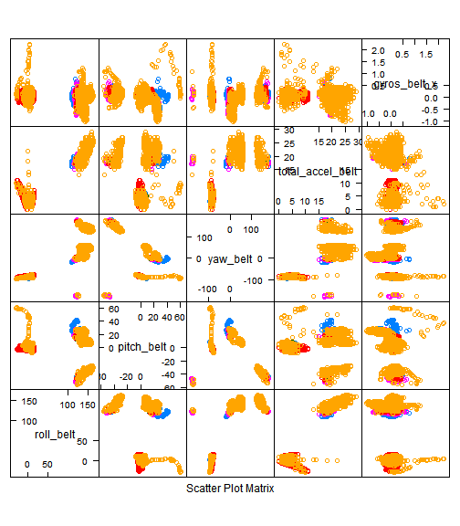
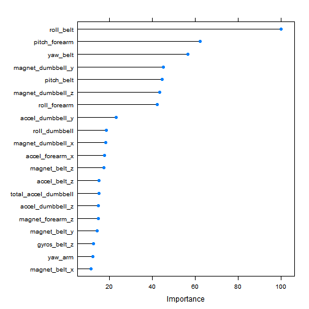
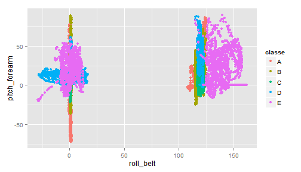

## Practical Machine Learning Course Project

## 1.0 Introduction

This project is based on a study for analyzing, providing feedback and predicting  how well a group of subjects performed a particular activity, such as weight lifting. Data for the project collected using accelerometers attached to the arm, belt, forearm and dumbbell of the subjects.  The subjects were asked to lift weights in one correct way and 5 incorrect ways. The goal of the project is to predict the manner in which the exercise was performed using the data that was collected.

## 2.0 Data and Preprocessing

The data for the project is provided as separate training and test files, in the following URLs.
[train](https://d396qusza40orc.cloudfront.net/predmachlearn/pml-training.csv) and 
[test](https://d396qusza40orc.cloudfront.net/predmachlearn/pml-testing.csv)

This data is uploaded and exploratory data analysis conducted.(See Appendix for figure)


```r
    training <-read.csv("pmltrain.csv")
    validation <- read.csv("pmltest.csv")
```


```r
    dim(training)
    dim(validation)
    str(training)
    View(training)
```
There are several variables that consist mostly (>80%) of NA values. Since these are measurements from individual monitors,not related to other variables, it is not correct to impute them with dummy values, that will give us incorrect predictions. Instead, variables with mostly NAs, and near zero variation are removed from the training set. Variables such as row number,time stamp and window are also removed, as they are obviously not predictors of performance.


```r
    library(caret)
```

```
## Loading required package: lattice
## Loading required package: ggplot2
```

```r
    nsv<-nearZeroVar(training)
    traintot <- training[,-nsv]
    traintot<-traintot[,-90, drop=FALSE]
    traintot <-traintot[,-(86:88), drop= FALSE]
    traintot <-traintot[,-(64:73), drop= FALSE]
    traintot <-traintot[,-(57:62), drop= FALSE]
    traintot <-traintot[,-(50:53), drop= FALSE]
    traintot<-traintot[,-40, drop=FALSE]
    traintot <-traintot[,-(11:26), drop= FALSE]
    traintot <-traintot[,-(3:6), drop= FALSE]
    traintot<-traintot[,-1, drop=FALSE]
    dim(traintot)
```

```
## [1] 19622    54
```
This training data set(traintot) is split into  further train and test subsets. The test subset will be used to estimate out of sample error rate, and to tune the model iteratively if required.

```r
    set.seed(3400)
    index <- createDataPartition(traintot$classe,p=0.8, list=FALSE)
    train <- traintot[index,]
    test <-traintot[-index,]
```

```r
    corMatrix <-cor(train[sapply(train, is.numeric)]) #finds correlation between numeric variables
    highcorrelation <- findCorrelation(corMatrix, cutoff = 0.75) # identifies predictors that are highly correlated with each other
# Though the correlation was studied, it was not used to eliminate features for model building in this project.
```

## 3.0 Algorithm and Evaluation

I decided to use the random forest algorithm to model the performance, as it is considered best to prevent over fitting.  The "rf" method of train function in caret package was selected (not the randomForest function) , because the former has built in cross validation.
K fold cross validation with 10 folds is used for building the model.


```r
    set.seed(25000)
    myControl <- trainControl(## 10-fold CV
                           method = "cv",
                           number = 10)                    
    myModel <- train(classe~.,data=train, method = "rf", trControl=myControl)
```

```
## Loading required package: randomForest
## randomForest 4.6-10
## Type rfNews() to see new features/changes/bug fixes.
```

```r
        myModel
```

```
## Random Forest 
## 
## 15699 samples
##    53 predictor
##     5 classes: 'A', 'B', 'C', 'D', 'E' 
## 
## No pre-processing
## Resampling: Cross-Validated (10 fold) 
## 
## Summary of sample sizes: 14128, 14130, 14129, 14131, 14130, 14128, ... 
## 
## Resampling results across tuning parameters:
## 
##   mtry  Accuracy   Kappa      Accuracy SD  Kappa SD   
##    2    0.9927385  0.9908134  0.002019353  0.002555772
##   29    0.9933119  0.9915396  0.002170918  0.002746172
##   57    0.9875156  0.9842065  0.003655786  0.004623990
## 
## Accuracy was used to select the optimal model using  the largest value.
## The final value used for the model was mtry = 29.
```

```r
        myModel$finalModel
```

```
## 
## Call:
##  randomForest(x = x, y = y, mtry = param$mtry) 
##                Type of random forest: classification
##                      Number of trees: 500
## No. of variables tried at each split: 29
## 
##         OOB estimate of  error rate: 0.57%
## Confusion matrix:
##      A    B    C    D    E class.error
## A 4458    4    1    0    1 0.001344086
## B   22 3011    5    0    0 0.008887426
## C    0    9 2721    8    0 0.006208912
## D    0    0   24 2547    2 0.010104936
## E    0    1    4    8 2873 0.004504505
```

```r
        trainprediction<- predict(myModel,train)
        #confusionMatrix(trainprediction, train$classe)
```

## 4.0 Prediction

The accuracy of the selected model for the training set is 100%. The model is applied to the test data without further tuning. 


```r
    testprediction<- predict(myModel,test)
    confusionMatrix(testprediction, test$classe)
```

```
## Confusion Matrix and Statistics
## 
##           Reference
## Prediction    A    B    C    D    E
##          A 1115    3    0    0    0
##          B    1  754    1    0    0
##          C    0    2  681    9    0
##          D    0    0    2  634    0
##          E    0    0    0    0  721
## 
## Overall Statistics
##                                           
##                Accuracy : 0.9954          
##                  95% CI : (0.9928, 0.9973)
##     No Information Rate : 0.2845          
##     P-Value [Acc > NIR] : < 2.2e-16       
##                                           
##                   Kappa : 0.9942          
##  Mcnemar's Test P-Value : NA              
## 
## Statistics by Class:
## 
##                      Class: A Class: B Class: C Class: D Class: E
## Sensitivity            0.9991   0.9934   0.9956   0.9860   1.0000
## Specificity            0.9989   0.9994   0.9966   0.9994   1.0000
## Pos Pred Value         0.9973   0.9974   0.9841   0.9969   1.0000
## Neg Pred Value         0.9996   0.9984   0.9991   0.9973   1.0000
## Prevalence             0.2845   0.1935   0.1744   0.1639   0.1838
## Detection Rate         0.2842   0.1922   0.1736   0.1616   0.1838
## Detection Prevalence   0.2850   0.1927   0.1764   0.1621   0.1838
## Balanced Accuracy      0.9990   0.9964   0.9961   0.9927   1.0000
```

The confusion matrix above gives an estimate of the accuracy on out of sample data to be 99.54%. The out of sample error is estimated to be 0.45%.

Since the model works well with the test set, it is applied to the validation set. (test cases provided).

```r
finalprediction <-predict(myModel,validation)
finalprediction
```

```
##  [1] B A B A A E D B A A B C B A E E A B B B
## Levels: A B C D E
```
The result was saved and submitted in the programming page. All predictions were correct, validating the model.

## 5.0 Additional Analysis

1. In real life projects, it is best to get a model with few predictors for ease of data collection, speed and accuracy of future predictions. So, I identified the most important predictors and built a model using just the top 20. The accuracy of this model on test data set was >90%. It is likely that in practice only these 20 measurements are monitored.

```r
    imp <-varImp(myModel)
```

2. Train control was was modified to change method to "oob"(well suited for random forest). The model performance was comparable to  the one with k fold cross validation and produced the same predictions with the validation data set. 


## Appendix

Fig 1 Plot showing relationship between the outcome variable classe and some predictors. Since there are 53 predictors, these plots were made in sets of 5.The plot below is a example.

```r
    featurePlot(x= train[, c(2:6)], y=train$classe, plot= "pairs")
```

 


Fig 2 shows the top 20 predictors in order of importance


```r
    plot(imp, top=20)
```

 

Fig 3 Shows top two predictors, and how the classe depends on them.

```r
p <- qplot(roll_belt, pitch_forearm,data= traintot,col=classe)
p
```

 

This shows that while the relationship between roll_belt and classe is very strong when roll_belt is >100, other factors are influential at lower values of roll_belt.


